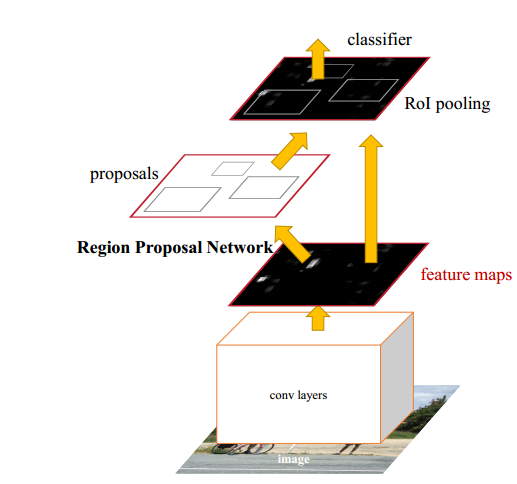

* RPN 网络结构：

>RPN是全卷积网络，由一层3*3卷积和两组并行的1*1卷积构成（1*1*2k对应score， 1*1*4k对应reg），由于全卷积，所以对feature map大小不限制。3*3的卷积核一般256个，对于51*39*C的特征图，卷积后成为51*39*256，对于vgg来说C=512，所以这一层有降维的作用。1*1卷几各有2k和4k个卷积核（k=9），输出为51*39*2k，51*39*4k，相当于特征图每个位置都有k个anchor的分数和坐标。

anchor内容包括两个部分：对最后一个feature map每个位置生成anchor；处理anchor的函数anchor_target_layer。
* generate_anchor：
>&emsp;代码首先在坐标原点处生成9个anchor（x,y,w,h表示），然后根据下采样率（feature map相对于原图缩放比例，VGG是16）将anchor平移到每个位置（所以x,y,w,h是在原图中的坐标值）。得到坐标形式的anchors。
  
* anchor_target_layer：
>&emsp;在这个函数里，会将ground truth的坐标形式转变为offset形式，这里是根据每个anchor最大IOU时对应的gt，所以gt数目和anchor是相同的（当然会出现同一个gt多次出现的情况，代码中还有一个每个gt对应IOU最大的anchor注意区分），这样根据论文中的公式gt就转变成了offset形式，这时的gt数目是51*39*k的。而RPN网络的输出值是offset形式不用转化。  
&emsp;当然offset形式的gt处理是为了计算loss服务的，由于negative比较多，为了使正负anchor在cls loss中贡献相同进行了negative hard mining，论文给的标准是每张图256个anchor，正负比例1:1.   
&emsp;注意rpn预测的box和offset形式的gt都是m*n*k个（m,n为特征图形状），只在计算loss时将正负anchor相匹配的gt以及对应位置的预测box统计进去。anchor匹配的gt就是此anchor IOU最大的gt。  

对于600*1000的图片RPN网络会生成20000多个proposal，注意proposal和anchor区别：anchor是在图像上每隔16像素生成的，不会被参数更新，所以称为锚；proposal是rpn输出的offset形式的坐标值加上对应位置的anchor得到的。由于对anchor标签化处理，使得只有gt附近的anchor为坐标回归提供了梯度，结果是gt附近anchor对应的proposal接近gt，远处的proposal使用了不对应的梯度不会有好的效果，后续的操作会将这部分滤除掉。

----------------------------------------------------------RPN---------------------------------------------------------------------------

* proposal_layer

首先根据rpn输出的offset坐标加上anchor得到proposal在原图中的坐标，过滤超出边界的proposal，之后选择score(RPN输出的) top6000的proposal（proposal太多且绝大部分是背景框，其实2000个proposal中也大多是背景框,在下一函数还要进行采样）-->NMS-->选择score top2000的proposal，这样剩余的proposal大约由2000个.

* proposal_target_layer

这一层要为下面的ROI pooling做准备，首先对proposal进行采样，代码中每张图采样128个proposal其中postive为32个剩余为negative（与gt IOU>0.5: postive; 0.1<IOU<0.5: negative），保证pos:neg=1:3。 其次将label设置为21类（pascal voc）形式，将negative proposal设为背景类， positive proposal设为更具体的20类（label取值为proposal交并比最大的gt对应的类别）。 

* ROI pooling

将proposal对应的原图区域crop下来，由于接下来是fast rcnn有全连接层，所以保证特征长度相同，所以进行ROI pooling将crop下来的图像region池化为相同大小并展成向量形式，送入fast rcnn。ROI pooling大约是根据特征图大小和池化后大小对高宽进行不同程度的池化。

参考文献：

[1] https://arxiv.org/abs/1506.01497 

[2] https://tryolabs.com/blog/2018/01/18/faster-r-cnn-down-the-rabbit-hole-of-modern-object-detection/

[3] https://github.com/smallcorgi/Faster-RCNN_TF
