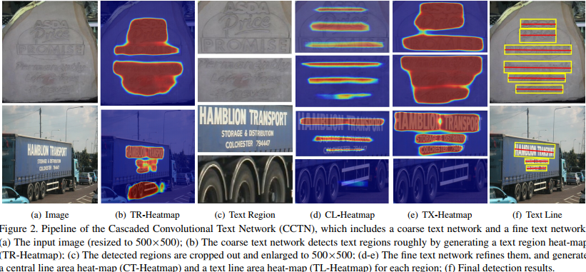
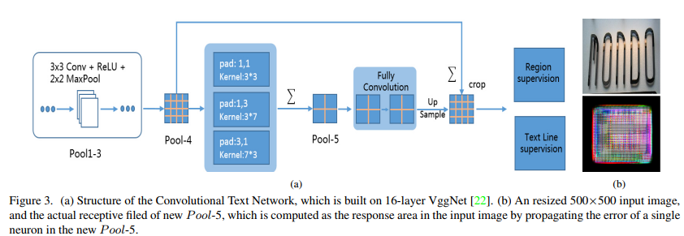
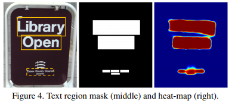
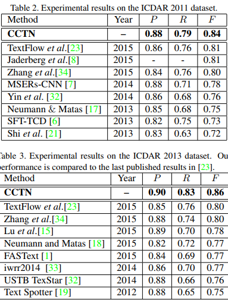
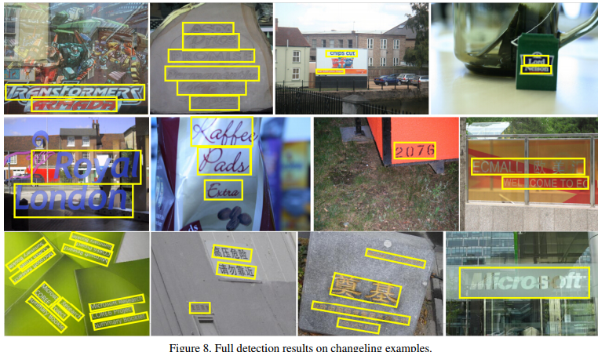

# Introduction
* 自底向上方法（bottom-up）的流程：

&emsp; - 通过MSER或SWT检测器检测字符或笔画特征。低级特征（像素级）不稳定，易受光照等影响。

&emsp; - 使用字符级分类器滤除非文本的假阳性检测。  由于上一步会产生几十倍文本区域数量的非文本区，所以会给分类器带来巨大挑战（可能是由于不平衡问题）。

&emsp; - 将剩余字符区域聚合成文本行。需要引入启发式规则和几何特征，以及手工设计的聚合规则和参数，泛化能力差。误差逐步积累，使bottom-up方法不可靠。

* 传统方法引入CNN的改进：

&emsp; - 字符级CNN到文本线（文本块）级CNN

&emsp; &emsp;  利用周围文本信息（上下文），相较于字符级CNN（第二步）而言更加鲁棒。

&emsp; - 全连接层变为全卷积。

&emsp;&emsp;  全连接层丢失了位置信息，虽然对分类问题更高效，但不利于定位问题

&emsp; - 池化会降低计算量增大接受域，而且增加局部变换（具体指？）的不变性，但是会损失定位精度。使用coarse-to-fine策略提高精度。

* 当前工作的难点    

1. 基于连通域的方法

像素级特征对不均匀光照， 尺度的不稳定性，而且没有上下文信息很容易受周围环境（叶子，细小纹理）影响；滤除非字符区的困难；后续处理同样复杂，很难设计合并字符区域通用的规则和参数。

2. 滑动窗口方法

通过不同尺度的窗口扫描图片，在窗口内计算局部特征。缺点：计算量大；如何设计具有区分性的特征和设计text/not-text分类器是难点；大多基于字符级特征，不稳定，不可靠，仍然需要后处理步骤。

3. CNN

作为高级特征提取器，用作字符级分类器中只是利用表示能力，不能完全利用提取全局特征的能力，论文参考Zhang et al.提取的对称特征，认为文本块级CNN完全有能力提取出类似的特征。

# coarse network

包括coarse text network 和fine network两个网络，首先由coarse网络得到文本块的heatmap， 再由fine网络分离出文本行。

* 网络结构

是基于VGG-16改造的，pool3之前的结构相同，创新点有两个：

1. 不同长宽比的卷积核（处理不同形状）

使用了3*3,3*7，7*3的并行卷积核，形状的不同直接导致了接受域的不同，更有利于检测水平和竖直的文本区域。同时使用不同卷积核卷积的时候使用不同的padding使特征图形状一致。之后对特征图进行求和融合特征。

2.  不同分辨率特征图融合（处理不同尺度）

>Text network给出heatmap，指明了文本概率和位置信息。heatmap的gt（文中称mask）处理：gt box内为1，外围0. 本文使用了分割的思路，对heatmap进行像素级的softmax loss计算。     
>接受域是神经元的响应区域，网络设计中最后一层特征图的接受域应该接近网络输入，否则无法处理占满图片的目标，而且上采样不影响接受域。pool_5的接受与达到403*403，所以输入的时候将图片resize为500*500（不理解为什么不利用全卷积网络任意输入大小？）。

* 文本块提取

对heatmap二值化处理，阈值0.3，计算 area ratio and borderline ratio（不理解具体含义），area ratio>0.7  and borderline ratio>5认为是大尺寸的文本行直接提取，否则以文本块的最长边的1.2倍为边长crop正方形区域，resize成500*500送入fine网络微调。
作者发现对于大尺度且没有相邻文本的文本块，coarse网络检测精度很高，所以就直接提取了。

# fine network

fine网络结构和coarse网络相同，只是输出有2个heatmap： central line heatmap, text line heatmap,分别使用cross-entropy, softmax loss计算（不知道为什么不统一使用softmax loss？）。
考虑到文本行的重叠问题，以及原图中可明显分离的文本行经过多次池化后feature变得confusion，如下图。作者参考Zhang et al.的对称结构认为使用中间行表示文本行比bounding box更合理。
对 central line的标签是将bbox的中线像素设1，然后以bbox高H的0.25为半径取高斯分布值，所以 central line area高是0.5*H,宽相同。

* 文本行提取

对 central line的heatmap进行二值化，然后求MAR（min area rectangle）,并将高扩大两倍是文本行的bbox。
同样对text line 的heatmap求MAR，并对上一步得到的文本行进行微调，具体操作文中没有涉及。

# Experiment

多语言多方向：

