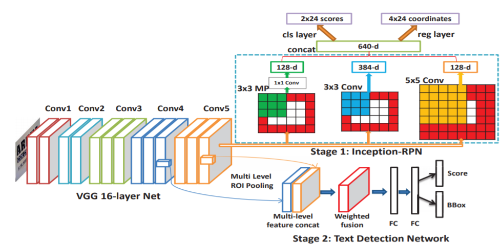
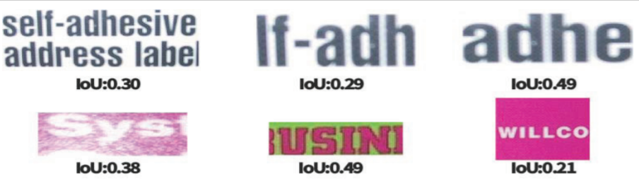
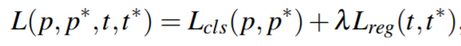
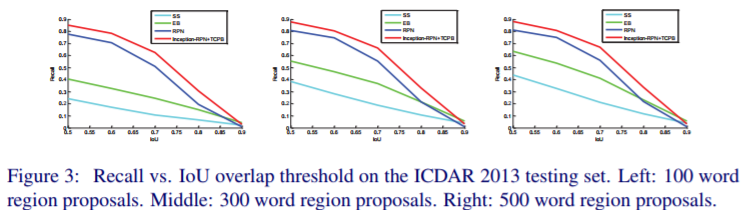
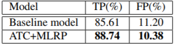
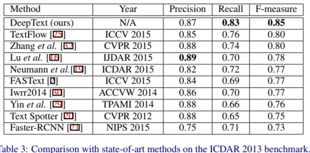

本篇论文是将faster-rcnn模型进行改进，应用于文本识别领域。下面主要看看本文对原模型的改进点：

1. RPN-->Inception-RPN

使用3x3卷积，5x5卷积，3x3 maxpool+1x1卷积的inception结构代替3x3卷积，并将深度增加至640。优点：使用不同接受域的卷积核有利于检测不同大小的文本；增强了RPN的表示能力，实验表明提高了recall值。

2. 扩展了anchor种类

本文anchor scale： (32, 48, 64, 80)，aspect ratio： (0.2,0.5, 0.8, 1.0, 1.2, 1.5)，原模型scale： (8，16，32)，aspect ratio： (0.5,1,1.5)，作者认为文本大多呈水平，所以使用了更多长宽比小于1的anchor。将原来的9种anchor扩展为24种，但是本文只使用几百个anchor送入fast rcnn相对于原模型使用2000个时间上可能不会耗时太久。

3. 细化分类

原模型根据IOU>0.5和0.1<IOU<0.5划分为正负样本，根据实验观察[0.2, 0.5]范围内仍存在模糊的文本，这样划分会迷惑网络学习，为了使正负样本更具区分性，作者增加Ambiguous Text类([0.2, 0.5])，non-text类(IOU<0.1)。所以RPN网络输出2类，而fast rcnn输出3类（text, ambiguous,non-text）。

4. 多尺度特征融合

在conv5_3和conv4_3分别作ROI pooling，有利于检测多尺度文本。

5.改进损失函数

Inception-RPN中平衡系数取3，得到更好的proposal位置，在fast rcnn中取1.

# Experiment

* 将Inception-RPN与RPN，SS，Edge box比较，横轴是IOU表示当IOU值大于坐标取值下认为TP并计算recall。发现在使用300个proposal时，Inception-RPN的召回率达到0.9，而RPN只有0.8.

* 在增加歧义类和多尺度ROI后，发现假阳性比原模型明显降低。作者对整个模型输出的proposal进行处理，IOU>0.5认为是TP，<0.5认为是FP。

* 在ICDAR2013上的表现，该网络只能检测水平文本。

