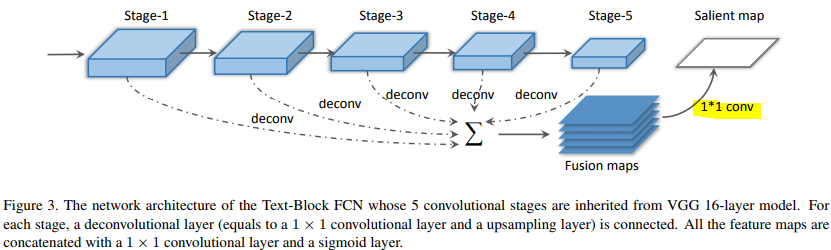
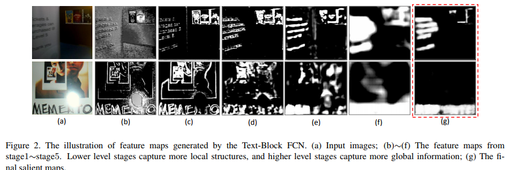
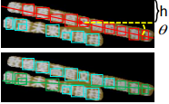
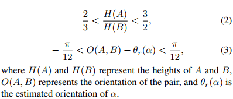
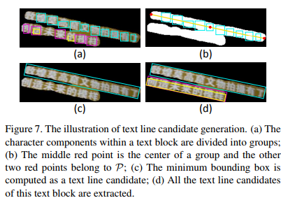
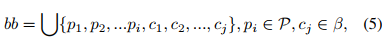
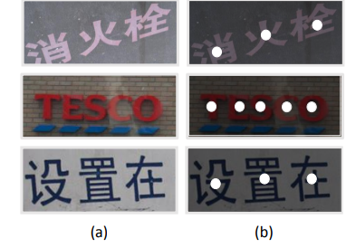
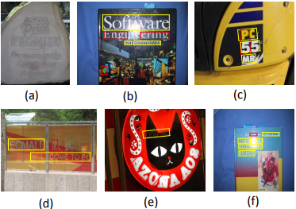

---
layout: post
title: "【CVPR2016】Multi-Oriented Text Detection with Fully Convolutional Networks"
date: 2018-6-27
tag: text detection 
---   

# Introduction

* 通过手工设计的字符特征训练字符分类器，以及通过文本行的对称性、自相似性来区分text/non-text，可以看出局部信息（字符区域）和全局信息（文本块）都对文本检测有帮助

* 作者认为在文本检测中使用字符分类器的思路(或者应该说是bottom-to-up思路)已经行不通，原因有：
1. 字符特征易受到不均匀光照、低分辨率和不连续笔画的影响；
2. 相似于字符的背景，树叶，砖块等；
3. 字符本身的变化，字体，颜色，语言等。

>总结为字符特征的不稳定性以及缺乏上下文信息，即使使用CNN强大的表示能力，表现也不尽人意。而文本块表现出更稳定和更具区分性的特征。

# 方法

首先通过全卷积网络（Text-Block FCN）对文本块进行检测得到salient map，然后结合MSER 字符区域的局部信息在文本块中提取文本行，最后通过全卷积网络（ Character-Centroid FCN）获取字符形心的salient map，并根据形心信息去除错误的文本行，并通过NMS去重。

* Text Block Detection

在VGG16前5个卷积阶段后都有反卷积层（等价于1x1卷积和上采样层），使输出的特征图具有相同的尺寸，并将反卷积后的特征图在通道维度上concatenate有利于检测不同尺度的文本。将VGG全连接层转化为1x1卷积层（上图高亮部分），并对融合后的特征图进行卷积，根据sigmoid layer得到salient map。

从阶段1到5细节信息原来越模糊，全局信息越来越强。

* Text Line Candidate Generation

这一部分使用MSER提取字符候选区域，而且使用了很多先验规则和手工设计的规则、参数来过滤，聚合候选区域，降低了算法的泛化能力，个人不喜欢这种提取文本行的方法。本文和上一篇cascade CNN提取文本块的方式一只（进行像素级预测），但是提取文本行部分很难，希望有更多好的思路。

1. MSER提取文本块内的字符区域，并使用先验知识过滤false positive。

2. 估计文本行方向

>本方法的假设条件：第一，同一block中，所有文本线的方向一致；第二，文本线是近直线的、

在text block里找到最优的h和θ（可以确定一条直线），使得该直线穿过的component个数最多；h是直线在垂直方向上截距（图中应该是以图片中心为原点），θ是与水平方向夹角。

根据每两字符区域高度的相似以及连线角度和直线倾斜角度相近来聚类。

每个簇作为component，$\beta=\{c_i\},c_i:第i个 component$。沿着block（记为α）的方向θr(α)的方向（上述直线的方向）画一条直线l，该直线经过这个$\beta$中的所有component的中心。求直线与文本块边界的交点（图中红点）。

利用点集P和每个componet的bounding box生成整条文本线的bounding box（求并集）。

* Text Line Candidates Classification
使用精简版的FCN（text-block FCN 5个stage只用了前3个）生成字符区域形心的salient map。
样本标注：在字符形心的15%倍字符宽度范围内，标注为positive区域。
根据形心的数目密度限制，以及形心连线角度的均值和方差（假定文本在同一直线上，所以角度分布不会相差太大）过滤非文本行。 

# Experiments

ICDAR2015

precision , recall, F:  0.71,  0.43,  0.54

ICDAR2013:

precision , recall, F:  0.88, 0.78, 0.83

失败的图：

such as extremely low contrast (Fig. 11 (a)), curvature (Fig. 11 (e)), strong reflect light (Fig. 11 (b) (f)), too closed text lines， tremendous gap between characters (Fig. 11 (d)).

1. 提取文本行使用的方法前提就已经不能检测弯曲的文本行了。
2. 大量使用手工规则和参数，降低泛化能力。

看来文本行的提取还是需要更加泛化的方式。

# 其他读者的观点

1. 把text block（global）和character（local）的特点综合起来，这个想法非常好，要把Faster RCNN与component的方法结合起来可以参考这篇文章的一些思想。
2. 这是第一个用FCN来做文字的文章，虽然准确率高，但是pixel wise还是比较慢的。文字和其他目标检测不大一样，太细了。需要找其他方法来检测text block。

